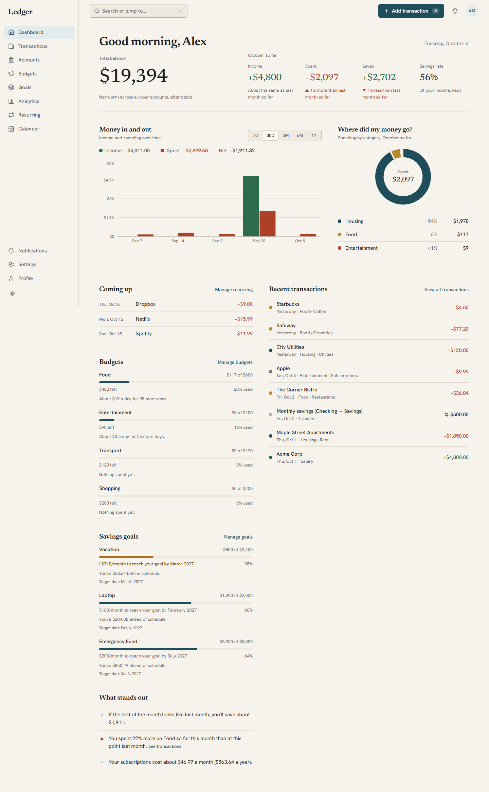
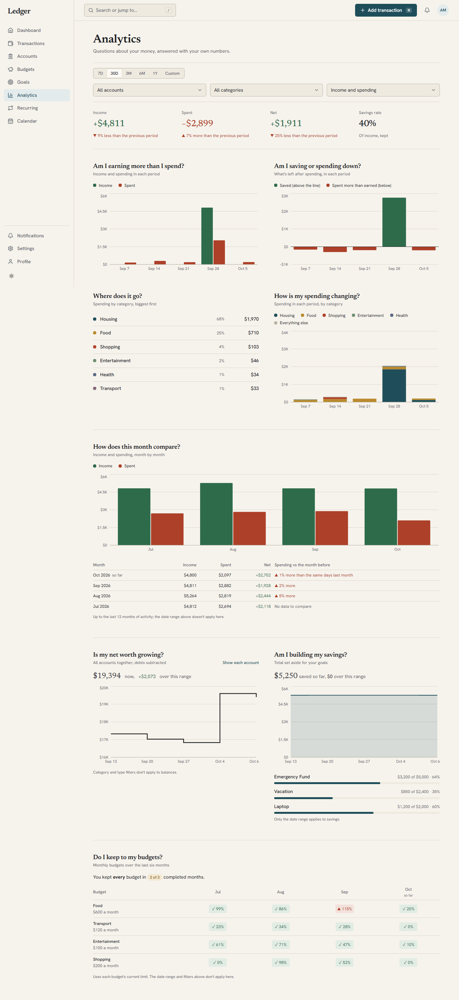

# Ledger

**A personal finance tracker where the numbers are right first and pretty second.**

Track accounts, spending, budgets, savings goals and subscriptions in one calm, fast, accessible app. Money is stored as exact integers (never floating point), every user's data is isolated, and the whole thing is covered by unit, integration and real-browser end-to-end tests.



## Features

- **Accounts and ledger:** checking, savings, cash, credit cards and investments; income, expenses, refunds and transfers (single-row, never double counted); balances that provably match the transaction history. Different currencies are kept separate, never silently converted.
- **Dashboard:** total balance, this month against last month, cash flow, spending by category, upcoming bills, budgets and goals needing attention, and plain-language insights ("Your subscriptions cost about $46.97 a month").
- **Budgets:** weekly, monthly or yearly limits per category with pace, projection and alerts.
- **Savings goals:** targets with deadlines, contributions, and "$160 a month to get there" guidance.
- **Recurring payments and subscriptions:** bills and paychecks recorded automatically on their due day (never twice), with monthly and yearly cost totals.
- **Analytics:** income vs spending, net worth over time, category trends, month-by-month comparison, budget performance, with every chart also available as a data table.
- **Calendar, notifications and search:** a month view of what happened and what's due; once-per-period alerts; natural-language search such as _"expenses over $50 last month"_.
- **CSV import and export:** preview before importing, column mapping, duplicate detection that makes re-importing safe, and exports that defuse spreadsheet-formula injection.
- **Designed for real use:** light, dark and system themes; a distinct phone layout; keyboard-first (press `/` to search, `N` to add); WCAG 2.2 AA tested in a real browser.

|                                                 |                                                        |
| ----------------------------------------------- | ------------------------------------------------------ |
|  | Every screen is checked at 1440, 1280, 768 and 390 px. |

## Tech stack

| Layer    | Technology                                                                                                                               |
| -------- | ---------------------------------------------------------------------------------------------------------------------------------------- |
| Web      | React 19, Vite, Tailwind CSS 4, TanStack Query, React Hook Form + Zod, Recharts, Radix UI                                                |
| API      | Fastify 5, Prisma 6, PostgreSQL, Zod (OpenAPI docs at `/api/docs` in development)                                                        |
| Shared   | TypeScript monorepo (npm workspaces): money and finance logic, validation schemas, UI kit                                                |
| Security | Argon2id, server-side sessions in HttpOnly cookies, CSRF header + Origin allowlist, rate limits, Helmet, tenant isolation on every query |
| Testing  | Vitest, Testing Library, axe-core, real PostgreSQL for API tests, Playwright for end-to-end                                              |

## Project layout

| Path                  | What                                                                                    |
| --------------------- | --------------------------------------------------------------------------------------- |
| `apps/api`            | REST API, database schema and migrations, demo-data seed                                |
| `apps/web`            | The single-page web app                                                                 |
| `packages/finance`    | Money type and every financial calculation (integer minor units), shared by API and web |
| `packages/validation` | Zod schemas shared by API and web forms                                                 |
| `packages/types`      | Shared enums and types                                                                  |
| `packages/ui`         | Design system: tokens, components, theming                                              |
| `e2e`                 | Playwright end-to-end suite                                                             |
| `deploy`, `docs`      | nginx config; architecture, database, design, testing and deployment documentation      |

## Quick start

You need **Node.js 20.11+** (developed on 24) and npm 10+. No separate database install is required: `npm run db:dev` runs a real embedded PostgreSQL.

```bash
git clone <this-repo-url> ledger && cd ledger
npm install
cp .env.example .env          # then set SESSION_SECRET to a random string of 32+ characters
npm run db:dev                # terminal 1: embedded PostgreSQL on :54329
npm run db:migrate            # terminal 2: create the tables
npm run db:seed               # optional: demo data (sign in as alex@example.com / demo-password-123)
npm run dev                   # API on :4000, web on :5173
```

Open <http://localhost:5173>. Already have PostgreSQL (or Docker)? Point `DATABASE_URL` in `.env` at it and skip `db:dev`; `docker compose up -d db` starts one on the same port.

> **Windows:** `npm run db:migrate` may print an `EPERM … query_engine` warning while `db:dev` is running. The migration still applies; stop `db:dev` before running `npx prisma generate`.

## Commands

| Command                          | Does                                                                                 |
| -------------------------------- | ------------------------------------------------------------------------------------ |
| `npm run dev`                    | API and web in watch mode                                                            |
| `npm test`                       | Unit, integration and component tests (starts a throwaway real PostgreSQL by itself) |
| `npm run test:e2e`               | Playwright end-to-end suite in Chrome, on its own database and ports                 |
| `npm run typecheck`              | Strict TypeScript in every workspace                                                 |
| `npm run lint` / `format:check`  | ESLint / Prettier                                                                    |
| `npm run build`                  | Production bundles                                                                   |
| `npm run db:migrate`             | Create and apply migrations in development                                           |
| `npm run db:seed`                | Create the demo user and ledger (refuses to run in production)                       |
| `npm run db:explain -w @pfm/api` | Query-plan review against 200,000 synthetic transactions                             |

## Configuration

Copy [`.env.example`](.env.example). The ones that matter:

| Variable         | Purpose                                                                              |
| ---------------- | ------------------------------------------------------------------------------------ |
| `DATABASE_URL`   | PostgreSQL connection string                                                         |
| `SESSION_SECRET` | 32+ characters; signs the session cookie. The example value is refused in production |
| `WEB_ORIGINS`    | Browser origins allowed by CORS and the CSRF origin check                            |
| `COOKIE_SECURE`  | Must be `true` in production (HTTPS-only cookies)                                    |

In development, verification and password-reset emails are printed to the API log. **No email provider is wired up yet**; add one behind the `Mailer` interface before opening sign-up to other people.

## The rules the code is built around

- **Money is integer minor units** (cents). All arithmetic goes through `@pfm/finance`, never `number` maths on decimals.
- **Transaction amounts are positive**; direction comes from the type. A transfer is one row and is never income or expense.
- **Credit-card debt is a negative balance** and reduces net worth.
- **Every query is scoped to the signed-in user.** Someone else's record is a 404, not a 403.
- **Dates are calendar dates in the user's timezone**, so reports never drift across midnight.
- **Anything automatic is idempotent:** recurring payments, notifications and imports can be re-run without duplicating anything.

## Documentation

| Doc                                    | What's in it                                                    |
| -------------------------------------- | --------------------------------------------------------------- |
| [Architecture](docs/ARCHITECTURE.md)   | How each part works and why, phase by phase                     |
| [Database](docs/DATABASE.md)           | Schema, indexes, and the query-plan review                      |
| [Design system](docs/DESIGN_SYSTEM.md) | Visual language, tokens, accessibility rules                    |
| [Testing](docs/TESTING.md)             | The four test layers, how to run them, and what the audit found |
| [Deployment](docs/DEPLOYMENT.md)       | Docker Compose on one host, or any other host                   |
| [Roadmap](docs/ROADMAP.md)             | What was built in each phase and the known gaps                 |

## Deploying

```bash
cp .env.production.example .env.production      # fill in the secrets and your public https origin
docker compose -f docker-compose.production.yml --env-file .env.production up -d --build
```

Put HTTPS in front of port 8080 and read [docs/DEPLOYMENT.md](docs/DEPLOYMENT.md) for migrations, backups and operating notes. The Docker images have been written and reviewed but not yet built on a Docker host; expect to fix small things on the first run.

## Status

All twelve planned phases are complete (about 715 unit/integration/component tests and 148 end-to-end tests, all passing). Known limitations are tracked in [docs/ROADMAP.md](docs/ROADMAP.md). The main ones: no email delivery yet, recurring payments cannot be transfers, imports are income/expense into one account, and the end-to-end suite runs in Chrome only.

## License

No license has been chosen yet, which means all rights are reserved by default. Add a `LICENSE` file (for example MIT) if you want others to use or contribute to the code.
